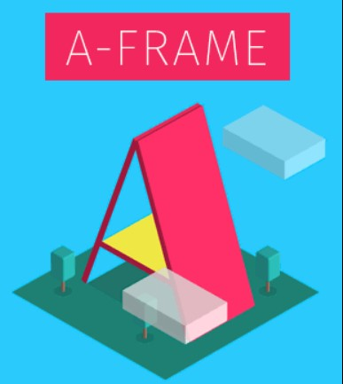

# [Dipneet Kaur](https://dipneetkaur.github.io) 

Hi, I'm Dipneet Kaur, a passionate developer from India. 
MCA, University Of Delhi  B.Sc.(Hons) Computer Science, University Of Delhi 

  
📫 Reach out to me :v:

___

**Languages and Tools:**  

<code></code> 
<code></code> &ensp;&ensp;&ensp;&ensp;&ensp;
<code></code>
<code></code>
<code></code>
&ensp;&ensp;&ensp;&ensp;&ensp;<code></code>
<code></code>
<code></code>
<code></code>
&ensp;&ensp;&ensp;&ensp;&ensp;<code></code>
<code></code>

___

    
  

   

 
*NOTE: Top languages does not indicate my skill level or something like that, it's a github metric of which languages I have the most code on github, it's a new feature of [github-readme-stats](https://github.com/anuraghazra/github-readme-stats)*

___

##### For more information about me, Visit here :smile:
 

___

